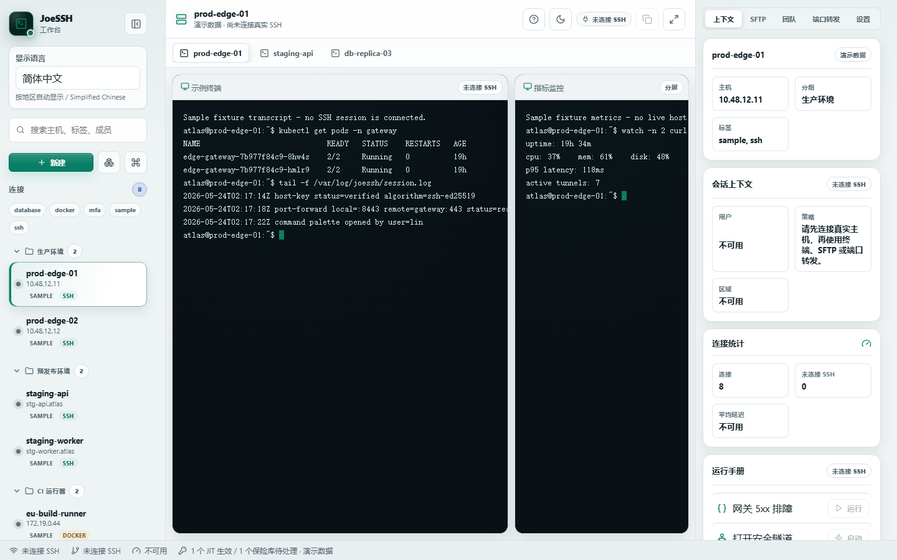
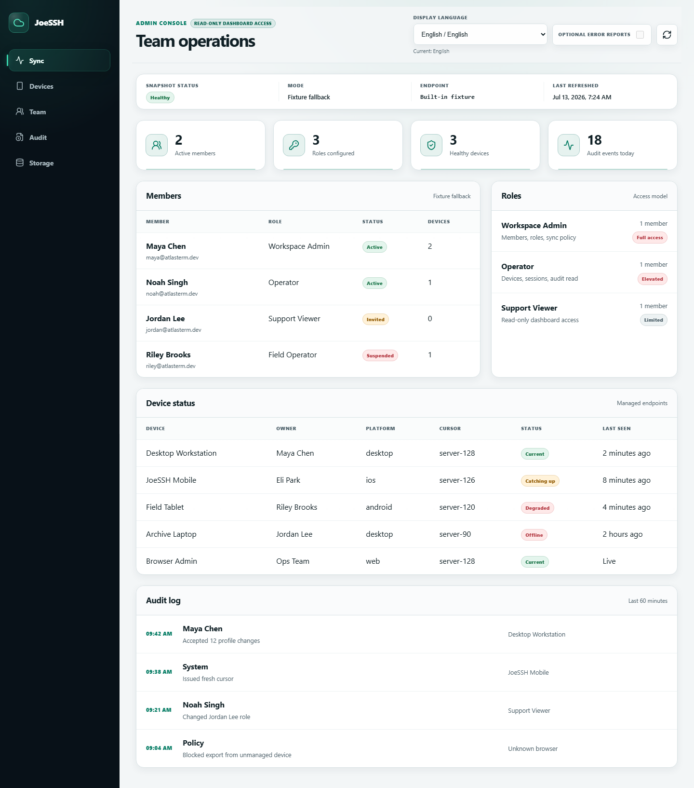

# JoeSSH

**SSH terminals, SFTP, and local port forwarding in one free Windows app.**

Connect to your servers, run commands, and transfer files from a desktop
workspace. No JoeSSH account is required; saved connection profiles and
workspace preferences stay on this device by default.

**[Get JoeSSH free on Microsoft Store](https://apps.microsoft.com/detail/9nk5llmf8lhm)**

Windows 10/11 x64 · Public Beta · Open source under the MIT License

[First connection guide](docs/getting-started.md) · [Report a problem](https://github.com/JoeWorkspace/JoeSSH/issues/new/choose) · [Privacy](PRIVACY.md)


This is a real E2E capture of the implemented interface with sample hosts and a
fixture terminal transcript, not a connected SSH session.
[More screenshots](#screenshots), including Simplified Chinese.

## What You Can Do

- **Work in SSH terminals:** connect with a password or pasted private key and
  organize interactive sessions in workspace tabs.
- **Transfer files with SFTP:** browse remote folders, upload, and download.
  Each upload or download is limited to **25 MiB** in the current Public Beta.
- **Use local port forwarding:** start and stop explicit tunnels bound to a
  loopback address on your own computer.
- **Keep connection details organized:** save local profiles, groups, and tags,
  and choose a light or dark theme.

JoeSSH asks you to verify an unknown server's host key before authentication
and blocks a changed stored key. Telemetry and error reporting are disabled
by default. There is no hosted JoeSSH service.

## Your First Connection In Three Steps

You need a reachable SSH server you are authorized to access, its hostname or
IP address, SSH port, username, and a password or private key.

1. **Install and open JoeSSH** from the
   [Microsoft Store](https://apps.microsoft.com/detail/9nk5llmf8lhm). No build
   tools or source checkout are needed.
2. **Add your server.** Select **New**, enter a name, host, SSH port (usually
   `22`), and username, then select **Create connection**. Open **Connect** for
   that profile and supply your password or pasted private key.
3. **Verify, then connect.** Compare the SHA-256 host-key fingerprint with a
   trusted source such as the server console or administrator. Only select
   **Trust and connect** when it matches. After connecting, open Terminal,
   SFTP, or Port Forwarding.

If a stored host key changes, stop and investigate; do not clear it just to
bypass the warning. See the [full walkthrough and troubleshooting](docs/getting-started.md)
if you cannot connect. Never share credentials, private keys, or sensitive
terminal output in an issue or screenshot.

## Distribution And Scope

The Windows app is available from the Microsoft Store. The project remains a
Public Beta: evaluate it for your workflow and keep backups before changing
important files. The existing beta.20 and beta.21 GitHub prereleases remain
source-only, as does the beta.22 GitHub prerelease; they are not Windows
installers. Unsigned CI bundles are for
staging and installation testing, not public distribution.

This repository also contains an optional self-hosted change ledger, a
preview-only Mobile shell, and a read-only Web Admin companion. Mobile is
outside the current public distribution scope. Web Admin is an
evaluation/community surface rather than a hosted or mutating team service.

[](.github/workflows/ci.yml)
[](#testing)
[](LICENSE)
[](https://nodejs.org/)
[](https://www.typescriptlang.org/)

## Build From Source (Developers)

Windows users can install from the [Microsoft Store](https://apps.microsoft.com/detail/9nk5llmf8lhm)
without Node.js, Rust, or a source checkout. The instructions below are for
contributors and source evaluation on other platforms.

Use the pinned Node.js `22.22.2`, npm `10.9.7`, and Rust `1.96.0` toolchains.
Install the platform-specific [Tauri prerequisites](https://v2.tauri.app/start/prerequisites/)
and put NASM on `PATH`, then install the locked dependencies:

```bash
npm ci
```

Launch the native Desktop runtime for real SSH, SFTP, and port forwarding:

```bash
npm exec --workspace @atlasterm/desktop -- tauri dev
```

For interface evaluation without a native SSH engine, launch the browser demo:

```bash
npm run dev:desktop
```

See [Getting Started](docs/getting-started.md) for OS prerequisites, the first
connection walkthrough, host-key safety, and the supported deployment paths.

## Deployment Paths

| Surface      | Current boundary                                                                                                                                                          | Guide                                                |
| ------------ | ------------------------------------------------------------------------------------------------------------------------------------------------------------------------- | ---------------------------------------------------- |
| Desktop      | Free Windows app on the [Microsoft Store](https://apps.microsoft.com/detail/9nk5llmf8lhm); source development on other platforms; unsigned CI bundles remain staging-only | [Desktop distribution](docs/desktop-distribution.md) |
| Web Admin    | Static, read-only companion; live data requires a same-origin authenticated proxy                                                                                         | [Web Admin deployment](docs/web-admin-deployment.md) |
| Sync Service | Self-hosted, single-process Public Beta service with a durable JSON ledger                                                                                                | [Sync self-hosting](docs/self-hosting-sync.md)       |
| Mobile       | Preview shell only; no public SSH/SFTP execution                                                                                                                          | Source evaluation only                               |

## Workspaces

- `apps/desktop`: React + TypeScript desktop workbench, wrapped as a native app by `apps/desktop/src-tauri` (Tauri 2). In the desktop runtime it drives the real Rust engine over IPC; in the browser preview it falls back to demo data.
- `apps/desktop/src-tauri`: Tauri 2 shell (own Cargo workspace) exposing the `atlasterm-core` SSH/SFTP/forward engine to the frontend as IPC commands (`ssh_connect`, `ssh_exec`, `sftp_list`, `sftp_read`, `forward_start`, `forward_stop`, `ssh_disconnect`).
- `apps/mobile`: React Native/Expo sync preview shell. It can register a preview device and pull non-secret preview state, but does not currently provide public mobile SSH/SFTP or emergency-access execution.
- `apps/web`: Read-only Web Admin viewer for live Sync team, device, role, and audit snapshots. Hosted SaaS and mutating team operations are not currently shipped.
- `crates/core`: Rust engine with a real `tokio` TCP port-forwarder, a real `russh` 0.61 SSH client (handshake, host-key verification, password/key auth, `exec`), interactive PTY shell sessions, SFTP (list/download/upload) via `russh-sftp`, and an SSH `direct-tcpip` forward bridge, plus the domain models, vault redaction, known-hosts, and safety helpers.
- `services/sync`: Rust Axum sync service with an in-memory or JSON-backed device/change ledger.
- `packages/error-monitor`: Shared browser error reporting with beacon/fetch transport.
- `packages/i18n`: Shared locale catalogs and translation completeness gate.
- `packages/ui`: Shared design tokens and UI primitives.
- `tests/e2e`: Playwright acceptance, release-surface, responsive, accessibility,
  and visual-regression suites.

> **Verification note:** the TCP port-forwarder is covered end-to-end by loopback integration tests. The SSH/PTY/SFTP/`direct-tcpip` paths are exercised by unit tests for their deterministic logic (host-key policy, fingerprinting) and verified to compile against the real `russh` API; a live handshake requires a reachable SSH server, and the Tauri GUI requires a desktop WebView2 runtime. Building `apps/desktop/src-tauri` requires NASM on `PATH` (the `russh` `ring` crypto backend assembles primitives at build time).

Rust/Cargo is required for native Desktop development and `npm run qa:rust`;
the JavaScript, mobile, E2E, and docs-contract QA lanes do not invoke Cargo
unless explicitly requested.

## Sync And Auth Config

The sync service listens on `ATLASTERM_SYNC_BIND`, defaulting to
`127.0.0.1:4100`. Set `ATLASTERM_SYNC_AUTH_TOKEN` before exposing `/v1` sync
routes beyond localhost; `GET /healthz` remains public for process probes.

> **Confidentiality boundary:** Public Beta Sync accepts and stores JSON payloads
> as provided; it does not currently provide end-to-end payload encryption. Put
> TLS and an authenticating reverse proxy in front of every non-loopback
> deployment, do not sync private keys, passwords, tokens, or other secrets, and
> encrypt sensitive application fields before submission. “Encrypted snippets”
> in the UI is a disabled future capability, not a shipped security guarantee.
> Environment-provided sync/admin bearer tokens must be at least 32 characters,
> contain no whitespace/control characters, and be distinct.
> Set `ATLASTERM_SYNC_STORAGE_PATH` to a JSON file path to persist registered
> devices, processed change IDs, accepted changes, and the latest cursor across
> service restarts. When unset, the service keeps the fast process-local ledger.

Browser CORS is closed by default. Use `ATLASTERM_SYNC_CORS_ORIGINS` for
comma-separated HTTP(S) CORS origins, or set
`ATLASTERM_SYNC_CORS_PERMISSIVE=1` only for local browser development. The
service rejects ambiguous configurations that combine both modes.

Companion clients have their own build-time settings:

- For local mobile preview only, `EXPO_PUBLIC_ATLASTERM_SYNC_AUTH_TOKEN` lets
  the mobile app call protected sync register, presence-push, and pull
  endpoints. `EXPO_PUBLIC_*` values are embedded in the mobile bundle, so do
  not use this token path for public mobile beta builds or shared production
  Sync services; those require pairing, OIDC, or device-scoped credentials.
- Web Admin live snapshots should use a same-origin `/api/admin/snapshot` proxy
  that attaches `ATLASTERM_SYNC_ADMIN_TOKEN` server-side; do not expose admin
  snapshot bearer tokens through browser build-time variables.
- Telemetry and error-report transport are disabled by default for Public Beta.
  Set `VITE_ATLASTERM_TELEMETRY_OPT_IN=1` or
  `EXPO_PUBLIC_ATLASTERM_TELEMETRY_OPT_IN=1` only after explicit user consent,
  and provide the matching `*_ATLASTERM_ERROR_MONITOR_ENDPOINT` value.

## Team Mode Commands

Use the scoped commands when multiple agents are moving different product areas at the same time:

```bash
npm run dev:desktop      # desktop workbench
npm run dev:web          # read-only team/admin snapshot viewer
npm run dev:mobile       # Expo mobile sync preview shell

npm run qa:desktop       # UI + desktop typecheck, Vitest, and production build
npm run qa:web           # web typecheck, Vitest, and production build
npm run qa:mobile        # mobile typecheck and mobile sync client tests
npm run qa:mobile:native-preflight # native mobile smoke config/tooling readiness
npm run qa:rust          # Rust workspace fmt, clippy, and tests; requires cargo
npm run qa:sync-api-docs # Sync API docs match shipped route/status/error contract
npm run qa:sync:self-hosted-smoke # local self-hosted sync auth/CORS/admin snapshot smoke
npm run qa:prod-audit    # high audit gate plus documented moderate risk register
npm run qa:subresource-integrity # built HTML has current SRI hashes for emitted assets
npm run qa:bundle-size   # web and desktop chunks stay within the 250KB budget
npm run qa:e2e           # Playwright acceptance suite
npm run qa:e2e:fresh     # Playwright acceptance suite on newly allocated local ports
npm run qa:i18n-release  # release-only translation completeness gate
npm run qa:release       # local release gate: qa + i18n release + native preflight
npm run qa:release:public # Public Beta gate: release gate + Rust + Tauri + audit + sync smoke + visual QA
npm run qa:release:strict # strict release gate: public gate + required mobile devices
npm run test:i18n-strict -w @atlasterm/e2e
```

Recommended parallel ownership:

- `apps/desktop` and `packages/ui`: desktop workbench, terminal UX, and evaluation-only team-access UI.
- `apps/mobile`: mobile sync preview and offline/error states; SSH/SFTP execution remains future work.
- `apps/web`: read-only team, role, device, and audit snapshots; mutations and billing remain future work.
- `crates/core` and `services/sync`: Rust core, sync service, protocol boundaries.
- `tests/e2e` and `docs`: acceptance coverage, QA checklist, release readiness.

## Verification

```bash
npm run typecheck
npm run test
npm run build
npm run install:browsers -w @atlasterm/e2e
npm run qa
npm run qa:release
npm run qa:release:public
```

`npm run qa:release` is the local release gate for this workspace. It runs the
normal developer QA lane, the release-only translation completeness gate, and
the native mobile smoke preflight. `npm run qa:release:public` adds Rust
fmt/clippy/tests, the Tauri shell release build check, high-severity audit,
documented production moderate dependency risk validation, self-hosted Sync
smoke, scripted visual QA, and Public Beta metadata checks. `npm run
qa:release:strict` adds simulator/emulator tooling checks, so it requires Cargo
plus Maestro and mobile device tooling on the host.

`npm run qa` includes lint, the Sync API docs contract check, handoff hygiene,
production SRI verification, security-header checks, bundle-size budget checks,
Playwright acceptance tests, and the real full-history secret scan. The latter
requires Gitleaks `8.30.1` on `PATH`; see
[`docs/release-preparation.md`](docs/release-preparation.md).
`npm run qa:rust` remains separate because it requires Cargo on `PATH`.

Use `npm run qa:e2e:fresh` when local Vite or Expo Web servers may already be
running. It allocates a fresh port set before starting Playwright, which avoids
reusing stale local bundles while preserving the normal E2E assertions.

`npm audit` currently reports Expo/React Native transitive moderate
vulnerabilities that require breaking Expo upgrades to resolve; current Public
Beta handling is documented in [docs/dependency-risk-register.md](docs/dependency-risk-register.md).

## Security

JoeSSH implements defense-in-depth security across all client apps:

- **Content Security Policy (CSP)** - Strict `default-src 'self'` HTML meta policy with explicit `worker-src 'self'` for service workers; static deployment `_headers` also set HTTP `frame-ancestors 'none'` and `X-Frame-Options: DENY` because CSP meta tags cannot enforce clickjacking protection.
- **Permissions-Policy** - 8 directives disabled: camera, microphone, geolocation, payment, USB, magnetometer, gyroscope, accelerometer.
- **Subresource Integrity (SRI)** - All production builds include SHA-384 hashes for CSS and JS assets.
- **Service Workers** - Cache-first for static assets, network-first for navigation, API requests bypassed.
- **Bearer Token Auth** - Constant-time token comparison on sync service endpoints.
- **CORS** - Non-loopback deployments require an explicit origin allowlist;
  permissive browser CORS is accepted only for loopback development when
  explicitly enabled.
- **Error Monitoring** - `@atlasterm/error-monitor` package with beacon-based reporting, breadcrumbs, deduplication, and rate limiting.
- **Automated Verification** - Security headers, SRI, and bundle size checked in CI pipeline.

## CI/CD

GitHub Actions runs on push, PR, and a weekly Monday schedule:

- Lint, typecheck, unit tests, production build
- Bundle size budget check (250KB per chunk, shared with local `npm run qa`)
- Subresource Integrity (SRI) verification
- Security headers validation (HTML CSP/meta plus deployment `_headers` for clickjacking and core browser headers)
- i18n release gate (translation completeness)
- Sync API docs contract check
- Rust workspace: `cargo fmt --check`, `cargo clippy --workspace --all-targets -- -D warnings`, `cargo test --workspace`
- Playwright E2E acceptance and visual QA suites across desktop, web, and mobile paths
- Lighthouse audit with strict thresholds (performance >= 0.95, a11y >= 1.0, best-practices >= 1.0)
- Axe checks tagged for WCAG 2.0, 2.1, and 2.2 A/AA, including the 24 CSS pixel target-size rule, plus focus-not-obscured and accessibility-assessment release contracts
- Security audit (`npm run qa:prod-audit`: high-severity `npm audit` gate plus dependency risk register validation)
- Dependabot for automated security updates

## Documentation

- [docs/getting-started.md](docs/getting-started.md) - Store installation, first real SSH connection, troubleshooting, and source development
- [ARCHITECTURE.md](ARCHITECTURE.md) - System design, data flow, security layers, and sync protocol
- [CONTRIBUTING.md](CONTRIBUTING.md) - Development workflow, code style, and commit conventions
- [SECURITY.md](SECURITY.md) - Vulnerability reporting and security measures
- [CHANGELOG.md](CHANGELOG.md) - Release history and notable changes
- [SUPPORT.md](SUPPORT.md) - Community support scope and safe reporting guidance
- [PRIVACY.md](PRIVACY.md) - Local-first privacy policy and fail-closed hosted/paid disclosures
- [ACCESSIBILITY.md](ACCESSIBILITY.md) - WCAG 2.2 and EN 301 549 assessment targets, EAA-oriented readiness status, limitations, and feedback route
- [docs/product-viability-review-2026-08-08.md](docs/product-viability-review-2026-08-08.md) - Feature-freeze and maintenance decision after the second public Beta
- [docs/product-excellence-plan.md](docs/product-excellence-plan.md) - World-class product completion plan and operating cadence
- [docs/release-preparation.md](docs/release-preparation.md) - Windows-first release operator runbook and external blockers
- [docs/windows-invite-beta.md](docs/windows-invite-beta.md) - 90-day Windows Desktop invite-only Beta playbook, safety boundaries, and success gates
- [docs/windows-store-release.md](docs/windows-store-release.md) - Separate Store EXE and external-MSIX candidate paths
- [docs/microsoft-store-listing-draft.md](docs/microsoft-store-listing-draft.md) - Fail-closed en-US/zh-CN Store copy, asset plan, and submission-field checklist
- [docs/commercialization-and-signing.md](docs/commercialization-and-signing.md) - Solo-developer monetization and signing strategy
- [docs/commercial-release-readiness.md](docs/commercial-release-readiness.md) - Fail-closed funding and paid-offer checklist
- [docs/sync-api.md](docs/sync-api.md) - Sync service REST API reference
- [docs/qa-checklist.md](docs/qa-checklist.md) - Release QA checklist
- [docs/release-checklist.md](docs/release-checklist.md) - Public Beta release checklist
- [docs/repository-release-handoff.md](docs/repository-release-handoff.md) - Healthy checkout recovery and release handoff
- [docs/desktop-distribution.md](docs/desktop-distribution.md) - Desktop signing and distribution
- [docs/web-admin-deployment.md](docs/web-admin-deployment.md) - Web Admin static deployment
- [docs/self-hosting-sync.md](docs/self-hosting-sync.md) - Self-hosted Sync Service deployment
- [docs/privacy-public-beta.md](docs/privacy-public-beta.md) - Opt-in telemetry and privacy rules

## Contributing

Please read [CONTRIBUTING.md](CONTRIBUTING.md) for detailed guidelines on development workflow, code style, commit conventions, and pull request process. All contributions must pass the configured coverage gates and the relevant QA suite.

The repository includes a lint-staged config that teams can wire into their
preferred local hook runner:

```bash
npx --no-install lint-staged
# *.{ts,tsx}: eslint --fix
# *.{json,md,yml,yaml,css}: prettier --write
```

## Testing

```bash
npm run test           # all workspace unit tests
npx --no-install vitest run --coverage  # tests with coverage report
npm run typecheck      # strict TypeScript checks
npm run qa:e2e         # Playwright acceptance tests
```

### Coverage Thresholds

Enforced by the checked-in Vitest configs:

| Scope                             | Config                         | Threshold                                      |
| --------------------------------- | ------------------------------ | ---------------------------------------------- |
| Desktop, web, and shared packages | `vitest.config.ts`             | 95% statements, branches, functions, and lines |
| Mobile workspace                  | `apps/mobile/vitest.config.ts` | 80% statements, branches, functions, and lines |

### Test Organization

- **Unit tests**: Co-located with source (`*.test.ts` next to `*.ts`)
- **E2E tests**: `tests/e2e/` using Playwright
- **Mobile tests**: `apps/mobile/test/` with react-test-renderer

## Performance

- **Bundle splitting** - Vendor and icon chunks separated via Rollup manual chunks
- **Chunk size budget** - 250KB warning limit, local QA and CI fail on violations
- **Lighthouse** - Current reports are retained under `reports/` and app workspaces; scheduled CI uploads fresh Lighthouse artifacts.
- **Lazy loading** - All 15 locale packs are code-split and loaded on demand

## Error Monitoring

JoeSSH includes a lightweight error monitoring package (`@atlasterm/error-monitor`):

- Disabled by default in Public Beta app shells until explicit opt-in
- Captures unhandled errors and promise rejections
- Breadcrumb trail (up to 30 entries) for debugging context
- Error deduplication (5s window) and rate limiting (10 reports per 60s)
- Error grouping by stack signature with health report API
- Core Web Vitals tracking (LCP, FID, CLS, FCP, TTFB, INP)
- Queues reports and flushes periodically (default: 30s)
- Uses `navigator.sendBeacon` when available for reliable delivery
- Falls back to `fetch` with `keepalive: true`
- Flushes on tab hide (`visibilitychange`) and page unload
- Configurable endpoint, queue size, and breadcrumb limits

See [packages/error-monitor](packages/error-monitor) for implementation details.

## Support The Maintainer

> [!WARNING]
> GitHub's Sponsor button only links to the voluntary-support notice; GitHub
> does not process these payments. Recipient, small-payment, and payout
> verification is not complete. Verify the recipient in the payment app before
> paying.

JoeSSH Community remains free and MIT-licensed. If JoeSSH has helped you and
you can comfortably do so, you can read the
[voluntary-support notice](docs/voluntary-support.md) and support its independent
maintainer. Support is not a purchase and does not provide paid features,
priority support, roadmap influence, or any other entitlement.

<p>
  <a href="docs/voluntary-support.md">
    
  </a>
  <a href="docs/voluntary-support.md">
    
  </a>
</p>

Before paying, read the complete notice and verify the recipient shown in the
payment app. These are personal collection codes; JoeSSH cannot cancel,
reverse, refund, or automatically return payments made through them.

## Screenshots

| Desktop workbench (English)                                                                                                      | Desktop workbench (Simplified Chinese)                                                                                                         |
| -------------------------------------------------------------------------------------------------------------------------------- | ---------------------------------------------------------------------------------------------------------------------------------------------- |
|  |  |

The Desktop images are real E2E visual-regression captures using labeled
sample data. They show the implemented interface, but no real SSH session is
connected and the terminal text is a fixture transcript.



The Web Admin image is a real E2E capture in read-only fixture-fallback mode.
It is a deployment preview, not evidence of a hosted JoeSSH service or live
team data.
